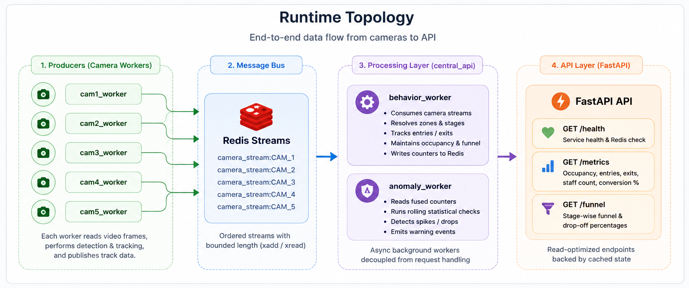
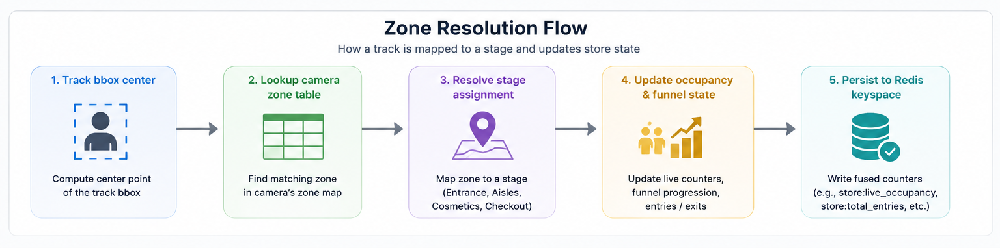
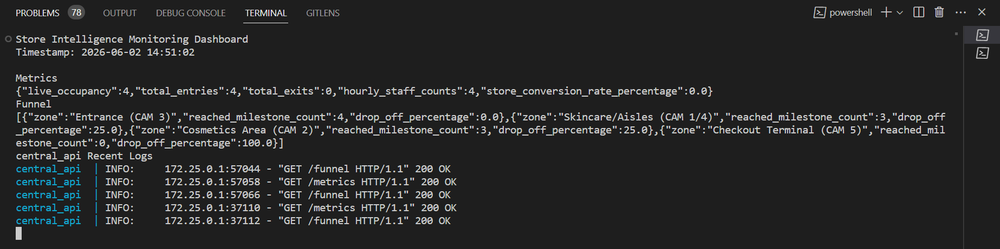
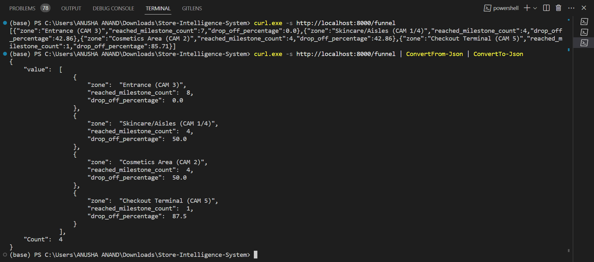

# Store Intelligence System

## Overview

Store Intelligence System is a containerized retail analytics stack that processes five parallel camera video streams. The system uses an asynchronous, decoupled producer-consumer architecture over an in-memory message bus to compute live retail metrics without hardcoded store-specific logic.

## Core Engineering Highlights

### Decoupled Architecture

Camera workers operate as independent high-speed producers, isolating compute-heavy video decoding from the central API logic via isolated Redis bridge networks to handle backpressure seamlessly.

### Algorithmic Efficiency

Replaced slow pairwise tracking loops with a 2D spatial hash grid array, dropping frame intersection matching complexity to a near constant-time average of $O(1)$.

### Data Integrity Controls

Implemented Least Recently Used (LRU) state eviction properties bound to a 45-frame Kalman velocity shadow cache to maintain unique shopper sessions across visual occlusions.

### Metric Convergence

Features programmatic constraints to maintain clean mathematical entry-exit bounds and deduplicates staff counts using active unique ID tracking sets.

## Platform Components

The system topology is split across isolated service layers:

* **redis_bus** : State broker tracking message ingestion streams across `broker_net` and `worker_net`.

* **central_api** : FastAPI service exposing analytic metrics to `public_net`.

* **`cam1_worker`** to **`cam5_worker`** : Core OpenCV/YOLO video workers optimized with a 2GB container hardware memory threshold limitation.

## Observability & Live Verification

The repository includes visual assets for validating system behavior and state transitions:

### System Blueprints
* **Runtime Topology Diagram**

* **Zone Resolution Flow Diagram**


### Verification Assets
* **Live Ingestion Dashboard View**


* **Natively Parsed REST API Response Contracts (`/funnel`)**
  
  
## Data Layout & Evaluation Configuration

To keep repository size manageable, raw camera video assets (`.mp4`) are excluded from version control and mounted locally at runtime through read-only container volumes.

### Required Asset Mappings

| Local Asset                                           | Container Path                   |
| ----------------------------------------------------- | -------------------------------- |
| `./data/Brigade_Bangalore_10_April_26 (1)bc6219c.csv` | `/app/data/transactions.csv:ro`  |
| `./data/Brigade Road - Store layoutc5f5d56.xlsx`      | `/app/data/store_layout.xlsx:ro` |
| `CAM 1.mp4` to `CAM 5.mp4`                            | `.:/shared_data:ro`              |

## Quick Start

### 1. Start Docker

Ensure Docker Desktop is running and the Docker engine is healthy.

### 2. Open Repository Root

Open a terminal in the repository root directory.

### 3. Build and Start Services

```bash
docker compose up --build
```

Await structural health checks to pass (`redis_bus` will report `service_healthy`).

### 4. Launch the Monitoring Dashboard

Open a second terminal window and launch the real-time monitoring console helper:

**Windows PowerShell**

```powershell
./inspect_dashboard.ps1
```

**Linux/macOS**

```bash
bash ./inspect_dashboard.sh
```

### 5. Review Live Telemetry

Monitor occupancy, entries, exits, conversion metrics, and system health as the video streams are processed.

### 6. Stop the Environment

Press:

```text
Ctrl + C
```

to stop the stack gracefully.

## API Endpoints

### `GET /health`

Validates service liveness and Redis connectivity.

Returns:

* Service status
* Redis availability
* Event loop responsiveness

### `GET /metrics`

Returns aggregated store metrics, including:

* `live_occupancy`
* `total_entries`
* `total_exits`
* `hourly_staff_count`
* `store_conversion_rate_percentage`

### `GET /funnel`

Returns stage-wise conversion metrics across the store journey, including drop-off percentages between funnel stages.

## Manual Endpoint Verification

Once the environment is running, verify endpoint responses with:

```bash
curl.exe -s http://localhost:8000/health

curl.exe -s http://localhost:8000/metrics

curl.exe -s http://localhost:8000/funnel
```

## Repository Structure

```text
Store-Intelligence-System/
│
├── README.md
├── DESIGN.md
├── CHOICES.md
├── docker-compose.yml
│
├── docs/
│   ├── runtime_topology.png
│   └── zone_resolution_flow.png
│
├── api/
├── worker/
└── data/
```
