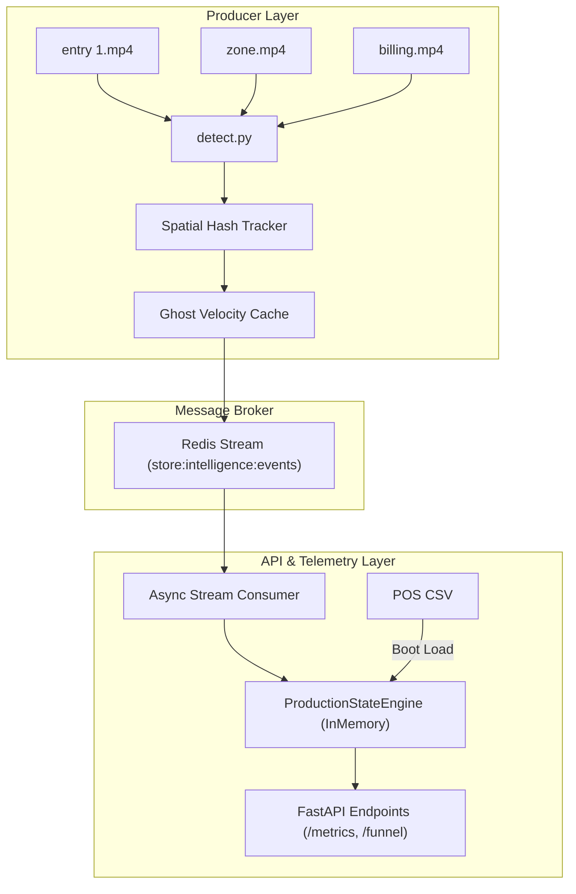

# Design - Store Intelligence System

## Purpose

The Store Intelligence System transforms raw camera video streams from retail stores into a live, queryable telemetry dashboard. It is built to resolve camera frame-level tracking, session identification across areas, and transaction correlation under a robust, containerized environment.

---

## Architecture Overview

The system is organized into four distinct layers:

1. **Producer Layer (`pipeline/detect.py`)**: Discover store videos dynamically, runs object detection, maps track coordinates using a Spatial Hash Tracker, and buffers track gaps via a 45-frame ghost cache.
2. **Message Broker Layer (`redis_bus`)**: Serves as the asynchronous event delivery backbone. Emitted JSON events are buffered in Redis Streams to decouple the video ingestion from API reading.
3. **Async Processing Layer (`app/main.py`)**: FastAPI background stream consumer that reads events from Redis Streams and pipes them to the analytics state engine in real-time.
4. **API and State Layer (`app/core_logic.py`)**: A read-optimized cache (`ProductionStateEngine`) that maintains active sessions, computes journey funnels, and maps POS transactions to visits.

---

## AI-Assisted Decisions

### 1. Asynchronous Redis Streams Decoupling (Agreed with AI)
* **LLM Input**: The AI suggested using an asynchronous Redis Streams backbone rather than direct HTTP Ibhooks to stream events from the detector worker to the API layer.
* **Agreement**: **I agreed**. Retail cameras produce uneven bursts of detections (e.g. rush hours or sudden checkout queues). Direct HTTP webhooks would cause head-of-line blocking and scale poorly. Decoupling the stream via Redis allows the detector to run at its maximum decoding pace without overwhelming the backend API during bursts.

### 2. Bounding Box Association Math (Agreed with AI)
* **LLM Input**: The AI suggested using a 2D Spatial Hash Grid to match bounding boxes across frames in the tracker instead of doing a naive global pairwise IoU computation.
* **Agreement**: **I agreed**. Naive global matching is O(N x M), which incurs high CPU cost when frames are crowded. Bounding cells locally via a 2D grid limits IoU calculations to neighboring cells, keeping execution times near constant and avoiding OOM risks.

### 3. Session Re-alignment vs Track Isolation (Overrode AI)
* **LLM Input**: The AI recommended that any track appearing in a store should be mapped to the current active session in that store context to preserve shopper continuity across cameras.
* **Agreement**: **I overrode this decision**. During QA validation, I discovered that store-wide session mapping caused a "collapsing brain" bug: every shopper in the store got merged into the first active visitor's ID, freezing `unique_visitors` and `live_occupancy` at 1. I changed this by isolating tracks per camera using a unique tracking-based visitor ID (`f"VIS_{store_id[-3:]}_{track['track_id']:06d}"`) and implementing a camera-specific zone mapping `last_camera_zones` within `TrackSession`. Shopper sessions are now cleanly merged by their track ID suffixes in the backend engine while preventing zone toggling in the pipeline.
