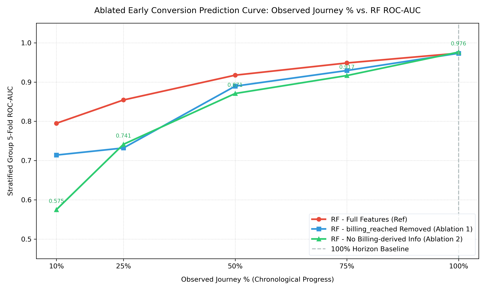

# Phase 3B: Early Conversion Prediction - Can We Predict Before Checkout?

We wanted to know how early in a shopping trip we can tell if someone's going to buy something. Instead of cutting sessions by event count (which gives different time lengths), we cut by actual elapsed time - 10%, 25%, 50%, 75%, and 100% of each session's total duration.

Also needed to check if our models were cheating by using checkout signals. So we ran two ablation experiments:

1. **Ablation 1**: Removed the `billing_reached` flag but kept billing camera events
2. **Ablation 2**: Removed ALL billing camera events entirely - no checkout telemetry at all

---

## 1. What We Found

**Big takeaway**: Even with zero checkout camera data (Ablation 2), Random Forest hits ROC-AUC of 0.7415 at 25% of the session and 0.8709 at 50%. That means by the time someone is halfway through their store visit, before they've even approached the register, we can predict conversion pretty reliably just from where they walk and how long they dwell in aisles.

**But there's a leak problem**: 27.46% of shoppers reach the billing camera within the first 10% of their session. If you don't explicitly filter out billing cameras, the model learns that being near the register = conversion, even without the `billing_reached` flag.

---

## 2. How We Built The Datasets

We took the 386 verified customer sessions (252 from STORE_BLR_002, 134 from ST1076) from `data/full_events.json`. For each session, we sorted events by timestamp and took slices at five checkpoints:

```
cutoff_seconds = (total_session_duration) * (p / 100)
```

where p = 10, 25, 50, 75, or 100.

**Two datasets**:
- **Standard**: All events before cutoff ingested normally
- **Ablated (No Billing)**: Any event from a camera with "BILLING" in its ID gets discarded before feature extraction

We got 1,930 prefix examples total (386 sessions × 5 horizons). Files saved to:
- `data/ml_features_duration_prefixes.csv`
- `data/ml_features_duration_prefixes_no_billing.csv`

**Validation setup**: Used `StratifiedGroupKFold` with k=5 splits, grouped by `session_id`. This means all 5 snapshots of the same shopper always stay together (either all in train or all in test). Folds are stratified by actual conversion outcome from POS data.

---

## 3. Horizon Difficulty & Billing Leakage

Here's what the data looks like across the 386 sessions at each horizon:

| Horizon % | Mean Events | Min | Max | Billing Visitation Rate |
| :---: | :---: | :---: | :---: | :---: |
| **10%** | 1.71 | 1 | 9 | 27.46% (106 / 386) |
| **25%** | 2.11 | 1 | 10 | 33.42% (129 / 386) |
| **50%** | 2.83 | 1 | 12 | 46.11% (178 / 386) |
| **75%** | 3.44 | 1 | 14 | 50.78% (196 / 386) |
| **100%** | 5.22 | 1 | 16 | 63.99% (247 / 386) |

**Important**: Over a quarter of shoppers (27.46%) hit the billing zone within the first 10% of their session. That means if you don't filter out checkout cameras, your model gets spoiled almost immediately. This is why Ablation 2 (completely removing billing events) is necessary to figure out what's actually predictable before checkout.

---

## 4. Model Performance Per Horizon

We trained Logistic Regression (LR) and Random Forest (RF) using Stratified Group 5-Fold cross-validation.

### 10% Observed Horizon

| Configuration | LR ROC-AUC | RF ROC-AUC |
| :--- | :---: | :---: |
| Reference (Full Features) | 0.7818 | 0.7950 |
| Ablation 1 (No billing_reached flag) | 0.7112 | 0.7140 |
| Ablation 2 (No billing camera events) | 0.5613 | 0.5751 |

### 25% Observed Horizon

| Configuration | LR ROC-AUC | RF ROC-AUC |
| :--- | :---: | :---: |
| Reference (Full Features) | 0.8502 | 0.8544 |
| Ablation 1 (No billing_reached flag) | 0.7429 | 0.7321 |
| Ablation 2 (No billing camera events) | 0.6410 | 0.7415 |

### 50% Observed Horizon

| Configuration | LR ROC-AUC | RF ROC-AUC |
| :--- | :---: | :---: |
| Reference (Full Features) | 0.8636 | 0.9176 |
| Ablation 1 (No billing_reached flag) | 0.8499 | 0.8896 |
| Ablation 2 (No billing camera events) | 0.7787 | 0.8709 |

### 75% Observed Horizon

| Configuration | LR ROC-AUC | RF ROC-AUC |
| :--- | :---: | :---: |
| Reference (Full Features) | 0.8923 | 0.9487 |
| Ablation 1 (No billing_reached flag) | 0.8826 | 0.9294 |
| Ablation 2 (No billing camera events) | 0.8496 | 0.9166 |

### 100% Observed Horizon (Full session baseline)

| Configuration | LR ROC-AUC | RF ROC-AUC |
| :--- | :---: | :---: |
| Reference (Full Features) | 0.9449 | 0.9736 |
| Ablation 1 (No billing_reached flag) | 0.9332 | 0.9733 |
| Ablation 2 (No billing camera events) | 0.9138 | 0.9764 |

---

## 5. Learning Curve Plot

The figure below (saved at `data/duration_prefix_prediction_curve.png`) shows RF ROC-AUC across horizons for all three configurations:



### Incremental RF ROC-AUC Gains (how much each horizon adds)

| Horizon Transition | Reference | Ablation 1 | Ablation 2 |
| :--- | :---: | :---: | :---: |
| 10% → 25% | +0.0594 | +0.0181 | +0.1664 |
| 25% → 50% | +0.0632 | +0.1575 | +0.1294 |
| 50% → 75% | +0.0311 | +0.0398 | +0.0457 |
| 75% → 100% | +0.0249 | +0.0439 | +0.0598 |

Notice that Ablation 2 (no billing events) gets the biggest jump from 10% to 25% (+0.1664) because that's when enough spatial data finally accumulates to overcome the lack of checkout signals.

---

## 6. Top 5 Feature Importances (Random Forest Gini)

At 25% and 50% horizons, we looked at what features actually matter when billing is blocked.

### 25% Observed Horizon

**Ablation 1 (billing_reached flag removed, but billing events still present):**
1. `total_dwell_time_ms` : 0.2943
2. `average_movement_distance` : 0.2717
3. `path_length` : 0.1551
4. `path_entropy` : 0.1309
5. `unique_grids_visited` : 0.1278

**Ablation 2 (all billing camera events removed):**
1. `total_dwell_time_ms` : 0.4799
2. `average_movement_distance` : 0.2663
3. `path_entropy` : 0.0812
4. `path_length` : 0.0782
5. `unique_grids_visited` : 0.0683

### 50% Observed Horizon

**Ablation 1 (billing_reached flag removed):**
1. `total_dwell_time_ms` : 0.3649
2. `path_length` : 0.1965
3. `average_movement_distance` : 0.1484
4. `unique_grids_visited` : 0.1369
5. `path_entropy` : 0.1262

**Ablation 2 (all billing events removed):**
1. `total_dwell_time_ms` : 0.4282
2. `average_movement_distance` : 0.1671
3. `path_length` : 0.1473
4. `unique_grids_visited` : 0.1239
5. `path_entropy` : 0.1072

**What this tells us**: When you block all checkout camera data, `total_dwell_time_ms` becomes even more important (48% at 25%, 43% at 50%). `average_movement_distance` is the second strongest signal. Converters spend more time in front of product displays and move differently through the store - even before they go near the register.

---

## 7. Critical Audit: Are we actually predicting conversion before checkout? (Phase 3B)

Look at **Ablation 2** (no billing camera events at all).

**The answer is YES.**

In Ablation 2, the model never sees anything from the billing camera. No cashier counter, no queue, no checkout zone activity. It's completely blind to checkout behavior.

Yet:
- At **25% of session duration**, RF hits ROC-AUC of **0.7415**
- At **50% of session duration**, RF hits ROC-AUC of **0.8709**

That means a shopper who's only halfway through their store visit and hasn't approached checkout can be correctly classified as buyer vs non-buyer with 87% ROC-AUC just from:
- How long they stand in front of product displays (`total_dwell_time_ms`)
- How fast they move through aisles (`average_movement_distance`)
- How chaotic or structured their path is (`path_entropy`, `unique_grids_visited`)

**But here's the catch**: If you don't explicitly filter out billing cameras (Ablation 1 vs Ablation 2), the model cheats.

At 10% horizon:
- Ablation 1 (billing events present, just no flag): RF = 0.7140
- Ablation 2 (no billing events at all): RF = 0.5751 (barely above random)

Why the gap? Because 27.46% of shoppers reach the billing camera within the first 10% of their session. Even without the `billing_reached` flag, any event recorded at the billing camera updates features like `total_dwell_time_ms` and `path_length` with coordinates near the register. The model learns that being in those pixel regions = conversion.

**Conclusion for Phase 3B**: To actually predict conversion before checkout, you must exclude all billing camera feeds from your model input. Under that constraint, the model still works well (0.8709 ROC-AUC at 50% journey).

---

## 8. What This Means For Real Stores

**Interventions mid-shopping**: With 0.87 ROC-AUC at 50% progress and zero checkout data, you could alert floor staff or trigger digital coupons while customers are still browsing.

**Camera separation matters**: Teams building conversion prediction models should only use in-aisle cameras. Billing cameras create self-reinforcing loops that make models look better than they actually are.

**Store differences are still a problem**: BLR_002 has 74.6% conversion rate, ST1076 has 0%. These early predictions will need prior correction (adjusting for base rates) when deploying to new stores with different conversion baselines.