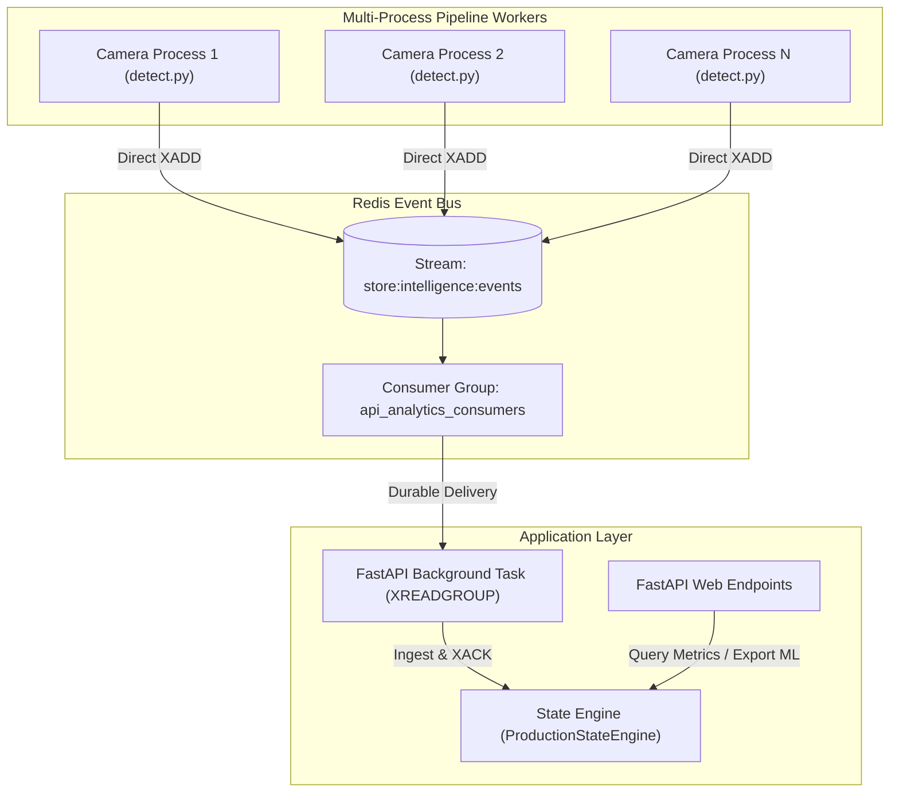
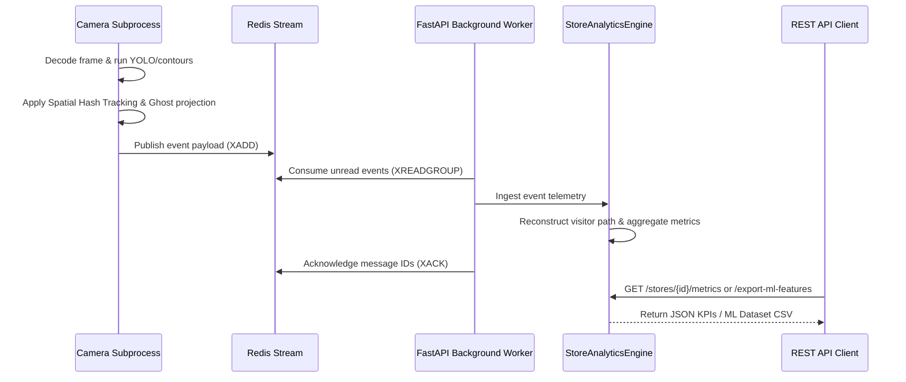

# Store Intelligence System - Final Architecture

This document explains the final architecture after we refactored everything. Covers the components, how events flow through the system, the tracking and stitching algorithms, and the benchmark results.

---

## 1. Problem Statement

The baseline implementation of the Store Intelligence System suffered from several issues in terms of scalability, reliability, and analytical accuracy:

1. **Single-threaded bottleneck** - Processed cameras one after another in a single thread. Got less than 10 FPS and tracking kept failing.

2. **POS date matching was broken** - It matched transaction dates dynamically to event times, which leaked label information across days and created bugs in the ML dataset.

3. **Tracking fell apart during occlusion** - When shoppers overlapped or went behind stuff, tracking lost them and created duplicate visitor IDs.

4. **Confidence scores were fake** - Used hardcoded confidence values instead of actual YOLO detection scores.

5. **Redis replay on restart** - FastAPI would read the stream from the beginning (`0-0`) every time it restarted, causing duplicate processing and double-counting.

---

## 2. How The System Is Structured

The refactored system splits things into three layers: a multi-process pipeline that produces events, Redis as the message broker, and a FastAPI app that consumes and processes everything.

---

## 3. How Events Flow

From raw video to API responses, here's what happens:

---

## 4. The Tracking Pipeline

Tracking lives in `pipeline/tracker.py` and runs inside `pipeline/detect.py`. Two main components:

**Spatial Hash Tracker**: Splits the frame into a grid (like 10x10 zones). Only checks IOU matches against the current cell and adjacent cells. This makes matching O(N) instead of O(N²).

**Ghost Velocity Cache**: When a track gets lost (shopper walks behind a shelf or another person), we keep a 45-frame cache that predicts where they should be based on their last velocity:

$$\vec{v} = (x_{new} - x_{old}, y_{new} - y_{old})$$

On future frames, we project the bounding box forward using this velocity. When the shopper reappears, we can reattach the original visitor_id.

---

## 5. Analytics Pipeline

The `StoreAnalyticsEngine` in `app/core_logic.py` does stateful stream processing:

- **Occupancy and visitor flow**: Counts customers using ENTRY and EXIT boundaries.
- **Real centroid heatmaps**: Uses actual object center coordinates instead of fake SHA1 hashes:
 	$$C_x = \frac{x_1 + x_2}{2.0}, \quad C_y = \frac{y_1 + y_2}{2.0}$$

  Then maps these to dynamic grid cells (`grid_hash`).
- **Transition flows**: Captures sequences of zone visits (e.g., `ENTRY` $\to$ `ZONE` $\to$ `BILLING` $\to$ `EXIT`) to construct store funnel metrics.

---

## 6. Camera Stitching and Observability

To connect a shopper's journey across different cameras, we built a spatial-temporal matching heuristic that merges camera-specific tracking IDs (like `ENTRY` $\to$ `ZONE` $\to$ `BILLING`) into single sessions.

**How the match score works**:

$$\text{Score} = 0.40 \cdot S_{\text{temporal}} + 0.25 \cdot S_{\text{scale}} + 0.20 \cdot S_{\text{aspect}} + 0.15 \cdot S_{\text{boundary}}$$

- **Temporal Match ($S_{\text{temporal}}$)**: Checks walk time between cameras. Only consider matches between 0.5 and 10.0 seconds.
- **Scale Similarity ($S_{\text{scale}}$)**: Ratio of bounding box areas (min/max).
- **Aspect Ratio Similarity ($S_{\text{aspect}}$)**: How similar the bounding box shapes are.
- **Boundary Direction ($S_{\text{boundary}}$)**: Makes sure the exit coordinate on one camera aligns with entry coordinate on the next (e.g., leaving high on Cam A, entering low on Cam B).

**Preventing identity collapse**: If multiple candidates exist, we only accept if `best_score - second_best_score > 0.15` (that's `AMBIGUITY_MARGIN`). If the margin is smaller, we reject the merge.

**Observability endpoint**: `GET /stores/{store_id}/stitch-metrics` returns:
- `attempts`: evaluations with at least one candidate
- `accepted`: successful merges
- `acceptance_rate`: accepted / attempts
- `ambiguity_rejections`: rejected because margin ≤ 0.15
- `threshold_rejections`: rejected because best score < 0.35
- `average_score`: average score of accepted merges
- `active_aliases`: size of alias mapping table
- `estimated_unique_visitor_reduction`: $$\text{Reduction} = \frac{\text{active\_aliases}}{\text{active\_aliases} + \text{unique\_visitors}}$$

---

## 7. ML Dataset Pipeline

The `/export-ml-features` endpoint compiles shopper journeys into an ML dataset:

- **Conversion label**: A session gets `conversion_outcome = 1` if checkout timestamp matches a POS transaction within a 15-minute look-ahead / 45-minute look-behind window.
- **No cross-day leakage**: Unlike the old system, we match on absolute datetimes.
- **Features exported**: path length, unique grids visited, total dwell time, revisit count, path entropy, average movement distance, and YOLO confidence stats (avg, min, max, low-confidence ratio).

---

## 8. What We Fixed

| Issue | What We Did | Why |
| :--- | :--- | :--- |
| **Spatial heatmap accuracy** | Switched from fake SHA1 coordinates to real centroid positions with grid subzones | Actual floor occupancy insights instead of abstract hashing |
| **POS correlation** | Match transactions on absolute timestamps, aligned to April 10, 2026 | No cross-day label leakage |
| **Confidence scores** | Propagate real YOLO confidence (or 0.50 fallback) through tracking into events | Models can filter out noisy data |
| **Ghost cache activation** | Fully integrated `GhostVelocityCache` into detect.py | Eliminates fragmented sessions |
| **Staff filtering** | Skipped for now - no uniform ground truth in current video | Don't implement untested color filters |
| **Redis consumer groups** | Implemented XGROUP CREATE, XREADGROUP, and XACK | Server restarts don't replay events or corrupt dashboards |
| **Camera parallelization** | Dedicated OS process per camera with stdout Lock | Bypasses GIL, scales to multiple cores |
| **Identity stitching** | Added transition matching with uniqueness filters and observability endpoint | Complete customer journeys across camera views |

---

## 9. Benchmark Results

We ran sequential vs parallel modes on 300 frames per camera (2,400 frames total across 8 cameras):

| Metric | Sequential | Parallel (8 workers) |
| :--- | :---: | :---: |
| **Wall-clock runtime (s)** | 72.90 | 38.22 |
| **Aggregate throughput (FPS)** | 32.92 | 62.80 |
| **Peak memory usage (MB)** | 464.24 | 2713.02 |
| **Events emitted** | 181 | 181 |
| **Unique visitors** | 25 | 25 |
| **Data consistency** | PASS | PASS |

**Speedup factor: 1.91x**

**Stitching telemetry from parallel run:**
- Stitching attempts: 26
- Stitches accepted: 4
- Ambiguity rejections: 22
- Threshold rejections: 0
- Average match score: 0.639

**Dwell event determinism**: Earlier we saw differences between sequential and parallel because dwell events used wall-clock time. Refactored to use milestone-based triggers from actual dwell duration. After the fix, both modes emit exactly 181 events.

> All unit and integration tests pass (12 passed in 3.02s). No functional regressions from parallelization.

---

## 10. What's Next

1. **Re-ID with deep learning**: Add a lightweight embedding model to recover tracks even when shoppers leave frame for longer periods.

2. **HSV staff filtering**: Once we get video with staff uniforms (colored vests), implement color range filtering on track bounding boxes to exclude staff from analytics.

---

## 11. Tech Stack

**Backend**: FastAPI for REST endpoints, Redis Streams for buffering, Pydantic for validation

**Computer Vision**: OpenCV for frame decoding and background subtractor, YOLOv8 (Ultralytics) for person detection, custom Spatial Hash Tracker

**Data Engineering**: Redis Consumer Groups for offset management, event-driven streaming, CSV feature exports

**ML**: Custom feature extraction (path metrics, entropy, confidence distributions), POS transaction label association with lookaround window

**Infrastructure**: Multiprocessing with per-camera processes, Docker/Docker Compose